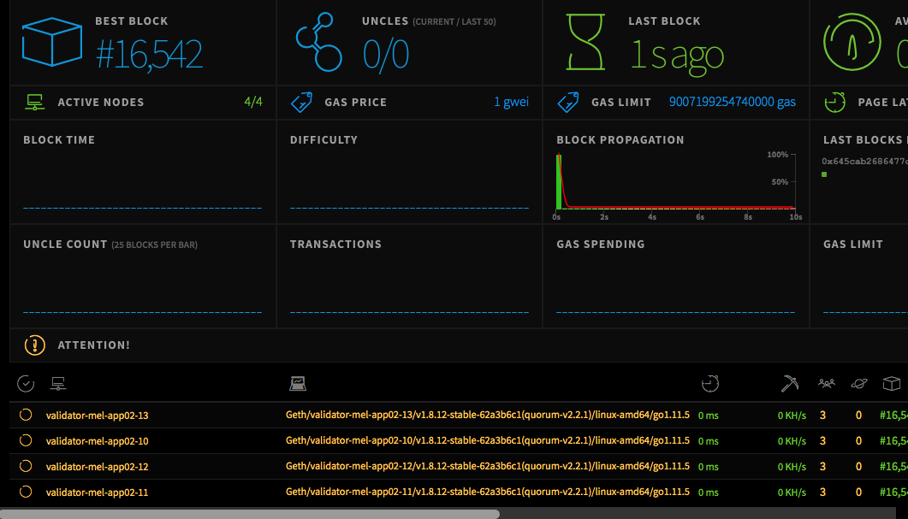
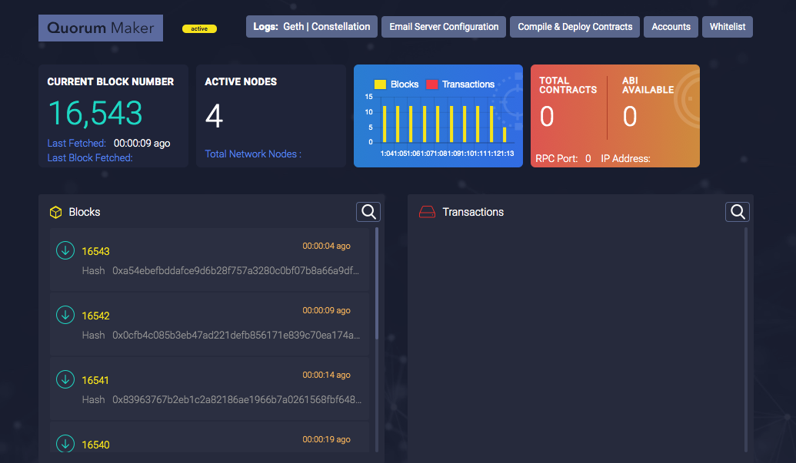
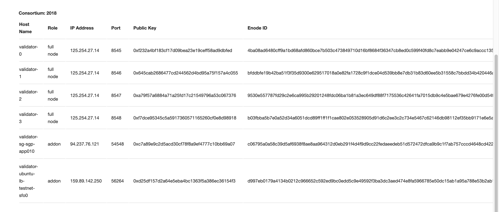

Setting up a local private TestNet
==================================

One-click Setup
---------------

ledgerium\_setup.sh is a unix bash file that downloads and deploys one
Ledgerium node (consists of Geth, Constellation/Tessera, and
GovernanceUI Docker containers) in a single click.

To download the installer go to the console and type

-   git clone https://github.com/ledgerium-io/ledgeriumsetup.git
-   cd ledgeriumsetup
-   ./install\_dependencies.sh

This script does the following:

-   Install prerequisite softwares (Docker and NodeJS) to run ledgerium
    tools.
-   Add \$USER to docker group, to avoid using sudo before docker
    commands
-   Creates a docker network

Once the dependencies are done installing go ahead and run the node

-   ./ledgerium\_setup.sh

This script prompts user for 3 parameters, mode addon, numbers of nodes,
and mnemonics for each node. The script creates a docker-compose file
and brings up the cointainers

* * * * *

Manual Setup
------------

### Prerequisites

-   NodeJS
-   NPM
-   Docker

### Downloading

Start up the terminal and enter the following commands:

-   git clone <https://github.com/ledgerium-io/ledgeriumtools.git>
-   cd ledgeriumtools

Ledgerium tools generates a docker-compose yaml for deploying N nodes
with IBFT consensus

### Update initialparams.json

Edit this file before running the application

1.  mode: Change mode type (full/addon)

    > -   If mode type is full, this application will create a
    >     ledgeriumnetwork folder outside ledgeriumtools which has
    >     static-nodes and externalised genesis files.
    > -   If mode type is addon, get latest ledgeriumnetwork files from
    >     github and paste those files under ledgeriumtools/output/tmp

2.  externalIPAddress : To host a node for a network that can be
    connected to by anyone outside your LAN
3.  nodeName : Hostname of the machine where nodes will be hosted.
4.  domainName : Domain name of the external IP Address. domainName is
    needed for every node to which any client wants to send transactions
    or do “geth attach”

### Run ledgeriumtools application

To start the application, run

-   node index.js

Takes input from the command line interface, prompts to enter number of
menmonics

-   Number of Mnemonics : 2
-   Enter Mnemonic 0 : ***\************\**************\**
-   Enter Password 0 : *******\********
-   Enter Mnemonic 1 : *********\************\********\****\***\*
-   Enter Password 1 : *******\********

Enter the Mnemonics and password which wilsl generate the nodekeys and
password

The number of nodes brought up is equal to the number of keys/menmonics
provided in the file i.e. n keys signifies n nodes with the respective
keys as coinbase/etherbase

The docker file will be generated in the output folder.

### Start the Ledgerium Network

Change directory to output and use

-   docker-compose up -d to start up the nodes
-   docker-compose down to bring down the nodes

Confirming Ledgerium Network is up and running correctly
--------------------------------------------------------

We can see if the application ran correctly by going to ethstats on
http://localhost:3000

This will show us:
:   -   Block data and minting status
    -   Validator/Node data
    -   Transactions statistics

We also have the Quorum dashboard accessible by http://localhost:9999

And the Governance user intreface accessible by http://localhost:3545

Note :

-   This application is currently using constellation as the
    private transaction manager.
-   Don't use the -v option to bring down the nodes as the current
    blockchain data will be lost
-   For subsequent runs make sure the tmp dir created in output folder
    is deleted

